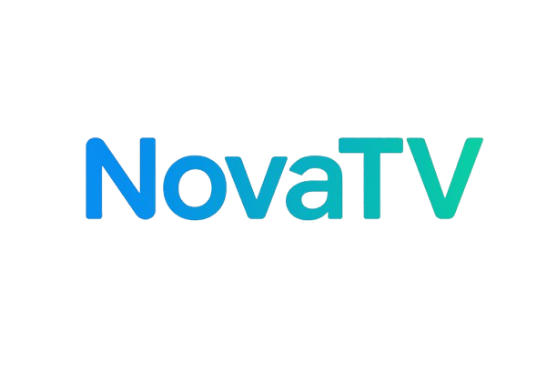

# NovaTV - 免費線上影視搜索觀看平台
注意，本項目為 LibreTV 進行二次開發

<div align="center">
  
  <br>
  <p><strong>自由觀影，享受自由</strong></p>
</div>

## 📺 項目簡介

LibreTV 是一個輕量級、免費的線上影片搜尋與觀看平台，提供來自多個影片來源的內容搜尋與播放服務。無需註冊，即開即用，支援多種裝置存取。專案結合了前端技術和後端代理功能，可部署在支援服務端功能的各類網站託管服務上。


## 🚀 快速部署

選擇以下任一平台，點選一鍵部署按鈕，即可快速建立自己的 NovaTV 實例：

[](https://vercel.com/new/clone?repository-url=https%3A%2F%2Fgithub.com%2FLibreSpark%2FLibreTV)  
[](https://app.netlify.com/start/deploy?repository=https://github.com/LibreSpark/LibreTV)  
[](https://render.com/deploy?repo=https://github.com/LibreSpark/LibreTV)

## 🚨 重要聲明

- 本項目僅供學習和個人使用，為避免版權糾紛，必須設定PASSWORD環境變量
- 請勿將部署的執行個體用於商業用途或公開服務
- 如因公開分享而導致的任何法律問題，使用者需自行承擔責任
- 專案開發者不對使用者的使用行為承擔任何法律責任

## ⚠️ 同步與升級

Pull Bot 會重複觸發無效的 PR 和垃圾郵件，嚴重干擾專案維護。作者可能會直接拉黑所有 Pull Bot 自動發起的同步請求的倉庫所有者。

**推薦做法：**

建議在 fork 的倉庫中啟用本倉庫自帶的 GitHub Actions 自動同步功能（請參閱 `.github/workflows/sync.yml`）。 

如需手動同步主倉庫更新，也可以使用 GitHub 官方的 [Sync fork](https://docs.github.com/cn/github/collaborating-with-issues-and-pull-requests/syncing-a-fork) 功能。

對於更新後可能會出現的錯誤和異常，在設定中備份配置後，首先清除頁面Cookie，然後 Ctrl + F5 刷新頁面。再次造訪網頁檢查是否解決問題。


## 📋 詳細部屬指南

### Cloudflare Pages

1. Fork 或克隆本倉庫到您的 GitHub 帳戶
2. 登入 [Cloudflare Dashboard](https://dash.cloudflare.com/)，進入 Pages 服務
3. 點選"建立專案"，連接您的 GitHub 倉庫
4. 使用以下設定：
 - 建置指令：留空（無需建置）
 - 輸出目錄：留空（預設為根目錄）
5. **⚠️ 重要：在"設定" > "環境變數"中加入 `PASSWORD` 變數（必須設定）**
6. 點選"儲存並部署"
   
### Vercel

1. Fork 或克隆本倉庫到您的 GitHub/GitLab 帳戶
2. 登入 [Vercel](https://vercel.com/)，點選"New Project"
3. 匯入您的倉庫，使用預設設定
4. **⚠️ 重要：在"Settings" > "Environment Variables"中加入 `PASSWORD` 變數（必須設定）**
5. 點選"Deploy"


### Docker
```
docker run -d \
  --name libretv \
  --restart unless-stopped \
  -p 8899:8080 \
  -e PASSWORD=your_password \
  bestzwei/libretv:latest
```

### Docker Compose

`docker-compose.yml` 文件：

```yaml
services:
  libretv:
    image: bestzwei/libretv:latest
    container_name: libretv
    ports:
      - "8899:8080" # 將內部 8080 端口映射到主機的 8899 端口
    environment:
      - PASSWORD=${PASSWORD:-111111} # 可將 111111 修改為你想要的密碼，預設為 your_password
    restart: unless-stopped
```
起動 NovaTV：

```bash
docker compose up -d
```
訪問 `http://localhost:8899` 即可使用。

### 本地開發環境

項目包括後端代理功能，需要支持伺服器端功能的環境：

```bash
# 首先，通過複製示例来設置 .env 文件（可選）
cp .env.example .env

# 安装依賴
npm install

# 啟動開發伺服器
npm run dev
```

訪問 `http://localhost:8080` 即可使用（端口可在.env文件中通過PORT變數修改）。


> ⚠️ 注意：使用簡單靜態伺服器（如 `python -m http.server` 或 `npx http-server`）時，影片代理功能將無法使用，影片無法正常播放。完整功能測試請使用 Node.js 開發伺服器。

## 🔧 自定義配置

### 授權碼保護

**重要提示**: 為確保安全，所有部署都必須設定 PASSWORD 環境變量，否則使用者將看到設定密碼的提示。


### API兼容性

NovaTV 支持標準的蘋果 CMS V10 API 格式。添加自定義 API 時需遵循以下格式：
- 搜索接口: `https://example.com/api.php/provide/vod/?ac=videolist&wd=關鍵詞`
- 詳情接口: `https://example.com/api.php/provide/vod/?ac=detail&ids=影片ID`

**添加 CMS 源**:
1. 在設定面板中選擇"自定義API"
2. 接口地址: `https://example.com/api.php/provide/vod`

## ⌨️ 鍵盤快捷鍵

播放器支持以下鍵盤快捷键：

- **空白鍵**: 播放/暫停
- **左右箭頭**: 快退/快進
- **上下箭頭**: 音量增加/減少
- **M 鍵**: 靜音/取消靜音
- **F 鍵**: 全螢幕/退出全螢幕
- **Esc 鍵**: 退出全螢幕

## 🛠️ 技術堆疊

- HTML5 + CSS3 + JavaScript (ES6+)
- Tailwind CSS
- HLS.js 用于 HLS 流處理
- DPlayer 影片播放器核心
- Cloudflare/Vercel/Netlify Serverless Functions
- 伺服器 HLS 代理和處理技術
- localStorage 本地儲存

## ⚠️ 免責聲明

NovaTV 僅作為影片搜尋工具，不儲存、上傳或散佈任何影片內容。所有影片均來自第三方 API 介面提供的搜尋結果。如有侵權內容，請聯絡對應的內容提供者。

本專案開發者不對使用本專案產生的任何後果負責。使用本項目時，您必須遵守當地的法律法規。

